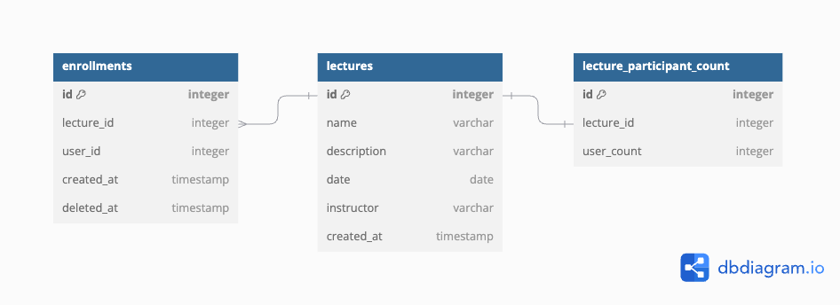

# Sugang

## ERD

* 특강 정보를 저장하는 `lectures`
  * 강연자 정보는 따로 뺴지 않고 `instructor` 정도로 이름만 표시
  * date는 특강일로 **토요일만 가능**
* 특강 등록 내역을 저장하는 `enrollments`
  * 유저 정보는 따로 빼지 않고 `userId` 정도로 아이디만 표시
* 특강에 등록된 사람의 정보를 저장하는 `lecture_participant_count`
  * 단순 개수이기 떄문에 lectures 테이블에 있어도 무방하나, Record 락을 이용해 동시성을 제어할 예정이고 최대한 좁은 범위에 락을 걸고 싶어 따로 테이블을 분리
